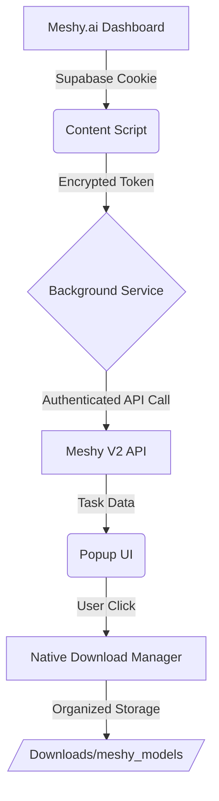

# 🎨 Meshy Downloader

<div align="center">

[](https://github.com/Pouare514/meshy-downloader/stargazers)
[](https://github.com/Pouare514/meshy-downloader/blob/main/LICENSE)
[](https://chrome.google.com/webstore)

**The ultimate companion for Meshy.ai creators. Download your 3D models and textures with a single click.**

[Features](#-key-features) • [Installation](#-installation) • [How it Works](#-how-it-works) • [Security](#-security)

</div>

---

## ✨ Key Features

Meshy Downloader bridges the gap between the web-based AI creation tool and your local creative workflow.

*   🚀 **Automatic Auth Detection** — No API keys needed. Just be logged into Meshy.ai.
*   📦 **One-Click Model Export** — Download `.glb` files directly to your machine.
*   🖼️ **Batch Texture Download** — Grab all generated textures (Base, Normal, Roughness) in one go.
*   🔍 **Rich Metadata** — View polygon counts (faces/vertices) and creation dates at a glance.
*   🎨 **Visual Gallery** — High-quality thumbnails for every model in your library.
*   📁 **Smart Organization** — Files are automatically organized in a `Downloads/meshy_models/` folder.
*   ⚡ **Ultra Lightweight** — Zero dependencies, built with high-performance Vanilla JS.

## 📦 Installation

### Developer Mode (Current Method)

1.  **Clone the Repository**
    ```bash
    git clone https://github.com/Pouare514/meshy-downloader.git
    cd meshy-downloader
    ```
2.  **Open Extensions Page**
    Navigate to `chrome://extensions/` in your Chrome browser.
3.  **Enable Developer Mode**
    Toggle the switch in the top-right corner.
4.  **Load the Extension**
    Click **"Load unpacked"** and select the `meshy-downloader` folder from this repo.

---

## 🔧 Usage

1.  **Login** to your account at [Meshy.ai](https://meshy.ai).
2.  **Click** the Meshy Downloader icon in your browser toolbar.
3.  **Hit "Fetch Models"** — the extension will automatically extract your session token.
4.  **Explore and Download**:
    *   Click **Download GLB** for the 3D model.
    *   Click **Download Textures** to save all associated maps.

> [!TIP]
> If a model has a short prompt, the extension will use it as the file name for better organization!

---

## 🛠️ How it Works

The extension uses a secure multi-layer approach to handle your data:



### Technical Stack
- **Manifest V3**: Compliant with the latest Chrome extension standards.
- **Chrome Storage API**: Securely holds session data locally.
- **Native Decryption**: Handles proprietary Meshy file formats on-the-fly.

---

## 🔐 Security & Privacy

We take your data seriously.
*   ✅ **100% Local**: No data is ever sent to external servers. Your token stays on your machine.
*   ✅ **No Background Tracking**: The extension only activates when you open the popup.
*   ✅ **Transparent Code**: Being open-source, you can audit every line of code.

---

## 🐛 Troubleshooting

| Issue | Solution |
| :--- | :--- |
| **"Token not found"** | Refresh your Meshy.ai tab and wait 2 seconds before clicking "Fetch". |
| **Models not loading** | Ensure you have an active internet connection and are logged in. |
| **Download fails** | Check if Chrome has permission to download multiple files. |

---

## 🤝 Contributing

We love contributions! Whether it's a bug fix, a new feature, or a UI improvement.

1. Fork the Project
2. Create your Feature Branch (`git checkout -b feature/AmazingFeature`)
3. Commit your Changes (`git commit -m 'Add some AmazingFeature'`)
4. Push to the Branch (`git push origin feature/AmazingFeature`)
5. Open a Pull Request

---

<div align="center">

**Made with ❤️ for the 3D Community**

[Report Bug](https://github.com/Pouare514/meshy-downloader/issues) • [Request Feature](https://github.com/Pouare514/meshy-downloader/issues)

</div>
